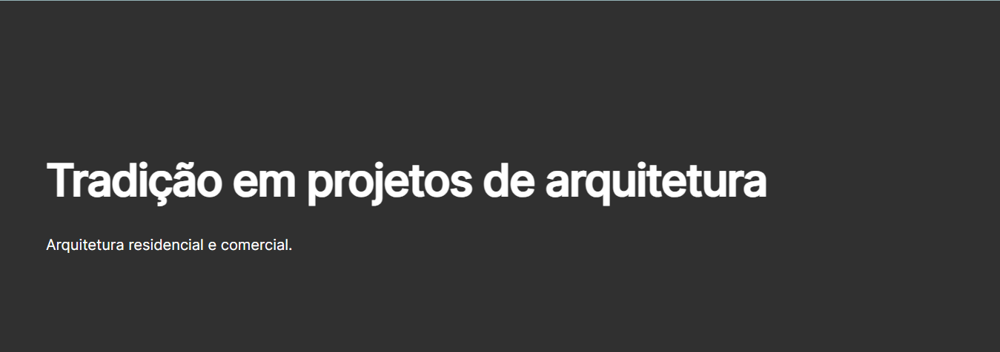
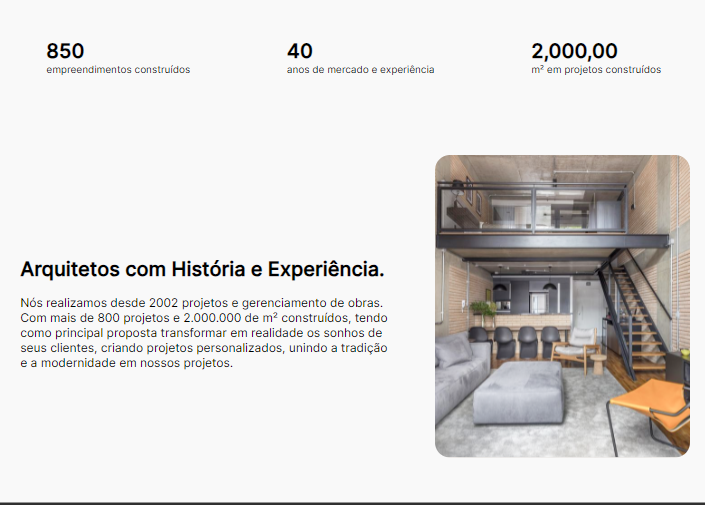
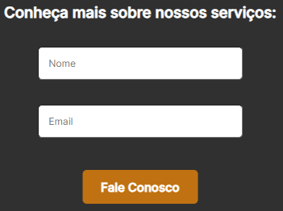
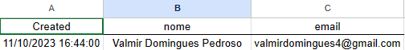

# Projeto Landing-Page Aquitetura

um projeto  simples desenvolvido para ser a Landing-page de uma empresa de Arquitetura. 

(Projeto de codigo autoral e contruido tendo apenas o figma como base)

## indice

- <a href="#-Funcionalidades-Do-Projeto">Funcionalidades do Projeto </a>

- <a href="#-Layout">Layout</a>

- <a href="#-Como-Rodar-Este-Projeto-?">Links Deste Projeto </a>

- <a href="#-Tecnologias-utilizadas">Tecnologias Utilizadas </a>

- <a href="#-Pessoas-Autoras">Pessoas Autoras </a>

## Funcionalidades do Projeto
- [x] Cadastro Do Nome 
- [x] Cadastro De Email Para Contato
- [x] Botão Interativo
- [x] Envio de Formulario
- [x] Banco de Dados (sheet-Monkeys)

## Layout
### Cabeçario

### Corpo 

com informações sobre a "empresa" e fotos (com a possibilidade de implementação do js para um slide)

### Formulario

 o mesmo sendo totalmente responsivel ao mouse !

## Links Deste Projeto

### link do site :

- clique aqui   [arquitetura.dnc](https://arquiteturadncc.netlify.app/) para ser Direcionado

- Endereço: <a>https://arquiteturadncc.netlify.app/</a>

    Status do site hospedado na Netlify:

  

### Link Da Planilha: 
     Planilha feita para Capturar Nomes e Emails de pessoas Interessadas na Proposta da Landing-Page !

- clique aqui   [arquitetura.dnc](https://docs.google.com/spreadsheets/d/1S05qcrjcuh8vrMCDsq-Gx5SV7b68bAlwG06-jStJarQ/edit) para ser Direcionado

- Endereço: <a>https://docs.google.com/spreadsheets/d/1S05qcrjcuh8vrMCDsq-Gx5SV7b68bAlwG06-jStJarQ/edit</a>

Exemplo:

### Tecnologias Utilizadas:
- [Vs-Code](https://code.visualstudio.com/)
- [Sheet-monkey](https://sheetmonkey.io/)
- [Netlify](https://www.netlify.com/)
- [Figma](https://www.figma.com/)

## Pessoas Autoras:
- Valmir Domingues Pedroso 

  Meu [Linkedin]() Pra vocês!! 🙂

